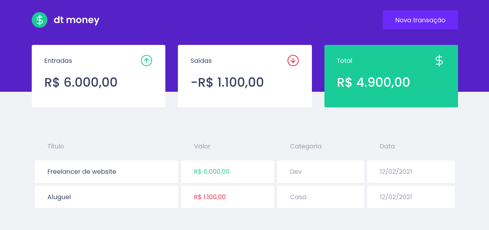
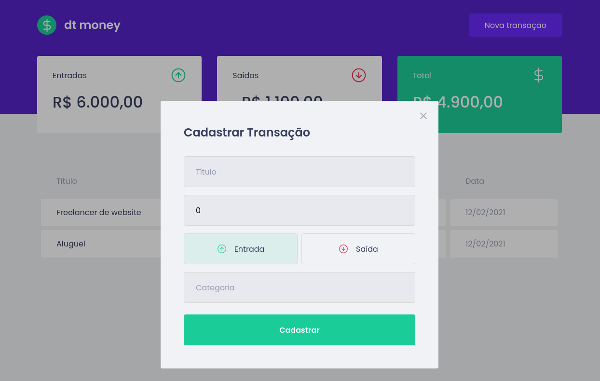

# DtMoney

Simple tool for financial control using ReactJS developed in the Rocketseat Ignite course.

## Screenshots

<div align="center" id="top"> 
  
</div>
<br/>
<br/>
<div align="center" id="top"> 
  
</div>
<br/>
<br/>

```bash
# Clone this project
$ git clone https://github.com/ewertonspezia/DtMoney

# Access
$ cd dtmoney

# Install dependencies
$ yarn

# Run the project
$ yarn start

# The server will initialize in the <http://localhost:3000>
```
